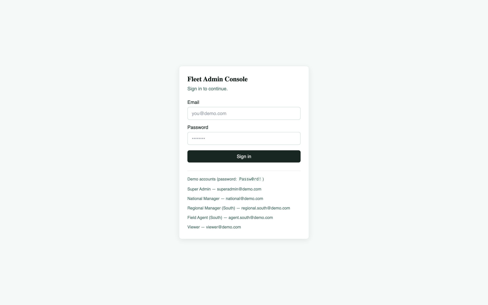

# RBAC Fleet Admin Dashboard

A full-stack demo application built around a **multi-tier role-hierarchy (RBAC) system** — the same pattern used on a production IoT device fleet-management platform (national manager → regional manager → field agent, permission-gated actions, org-scoped data access).



React admin console + Node.js/Express API + MongoDB, with JWT authentication and role-based access control enforced on both the server (the real security boundary) and the client (for a coherent UX).

## Why this exists

RBAC is easy to describe on a resume and easy to get subtly wrong in practice — checks that only live in the UI, roles that can escalate their own privileges, "admin sees everything" logic that never got extended when a new tier was added. This project is a small, complete reference implementation: a five-level role hierarchy, permission-gated routes, org-scoped data queries, and a UI that shows/hides itself based on what the signed-in role can actually do.

## Role hierarchy

```
SUPER_ADMIN
   └── NATIONAL_MANAGER
          └── REGIONAL_MANAGER
                 └── FIELD_AGENT
                        └── VIEWER
```

| Role | Can do |
|---|---|
| Super Admin | Everything |
| National Manager | Manage users, view all reports/tickets, assign devices |
| Regional Manager | View reports, manage tickets, assign devices — scoped to their region |
| Field Agent | Manage tickets assigned to them |
| Viewer | Read-only dashboard access |

The rule that matters most: **a role can only create, edit, or deactivate users at a level below its own** (`canManageRole` in `server/src/utils/permissions.js`). A Regional Manager can never grant someone National Manager access, even by directly calling the API.

## How RBAC is enforced (twice, on purpose)

1. **Server (the real boundary):** every protected route runs `requireAuth` (verifies the JWT, loads the user) then `requirePermission(...)` (checks the user's role against a permission map). User-management routes additionally run `canManageRole` to block privilege escalation. See `server/src/middleware/rbac.js`.
2. **Client (UX only):** `<RoleGate permission="...">` hides buttons/nav links the user can't use, and `<ProtectedRoute requiredPermission="...">` redirects away from pages entirely. Neither of these is a security control — they exist so the interface doesn't show dead ends. If someone bypassed the UI and hit the API directly, the server-side checks are what actually stop them.

## Project structure

```
server/
  src/
    config/db.js              MongoDB connection
    models/User.js            User schema, password hashing
    models/Ticket.js          Sample permission-gated resource
    middleware/auth.js        JWT verification
    middleware/rbac.js        Permission + role-hierarchy gates
    controllers/              Route handlers
    routes/                   Express routers
    utils/permissions.js      Role/permission map — single source of truth
    seed/seed.js               Seeds a demo org + sample tickets
    index.js                  App entry point
client/
  src/
    api/client.ts             Axios instance with JWT interceptor
    context/AuthContext.tsx   Login state, permission checks
    components/
      ProtectedRoute.tsx      Route-level auth/permission guard
      RoleGate.tsx            Inline conditional rendering by permission
      Sidebar.tsx, AppLayout.tsx
    pages/
      Login.tsx, Dashboard.tsx, Tickets.tsx, Users.tsx, Unauthorized.tsx
    types/index.ts             Shared types mirroring the server's role/permission model
```

## Running it locally

You'll need a MongoDB instance (local install, Docker, or a free [MongoDB Atlas](https://www.mongodb.com/atlas) cluster).

### 1. Backend

```bash
cd server
npm install
cp .env.example .env
# edit .env — set MONGO_URI and a real JWT_SECRET
npm run seed   # creates a demo org with one account per role
npm run dev    # starts the API on http://localhost:5000
```

The seed script prints the demo accounts it creates. All demo accounts share the password `Passw0rd!`.

### 2. Frontend

```bash
cd client
npm install
cp .env.example .env   # defaults to http://localhost:5000/api, adjust if needed
npm run dev             # starts the app on http://localhost:5173
```

Open `http://localhost:5173`, sign in with any of the seeded demo accounts (the login page lists them), and compare what a **Field Agent** vs. a **National Manager** can see on the Tickets and Users pages.

## API overview

| Method | Route | Permission required |
|---|---|---|
| POST | `/api/auth/login` | — |
| GET | `/api/auth/me` | authenticated |
| GET | `/api/dashboard/summary` | `view_dashboard` |
| GET/POST | `/api/tickets` | `view_dashboard` / `manage_tickets` |
| PATCH | `/api/tickets/:id` | `manage_tickets` |
| GET/POST | `/api/users` | `manage_users` |
| PATCH/DELETE | `/api/users/:id` | `manage_users` + role-hierarchy check |

## Tech stack

- **Backend:** Node.js, Express 4, MongoDB + Mongoose, JWT (`jsonwebtoken`), `bcryptjs` for password hashing, `helmet` + `cors` for baseline hardening
- **Frontend:** React 18 + TypeScript, React Router v6, Tailwind CSS, Axios

## What I'd add next

- [ ] Refresh tokens (current JWT is a single long-lived access token, fine for a demo, not for production)
- [ ] Audit log for permission-denied attempts and role changes
- [ ] Automated tests (Jest + Supertest for the API, React Testing Library for the client)
- [ ] Docker Compose file to spin up Mongo + API + client together

## Author

**Dhanyashree H P** — Senior Software Engineer (React.js, React Native, Mobile)
[linkedin.com/in/dhanya-chinivar-773b37115](https://linkedin.com/in/dhanya-chinivar-773b37115)
