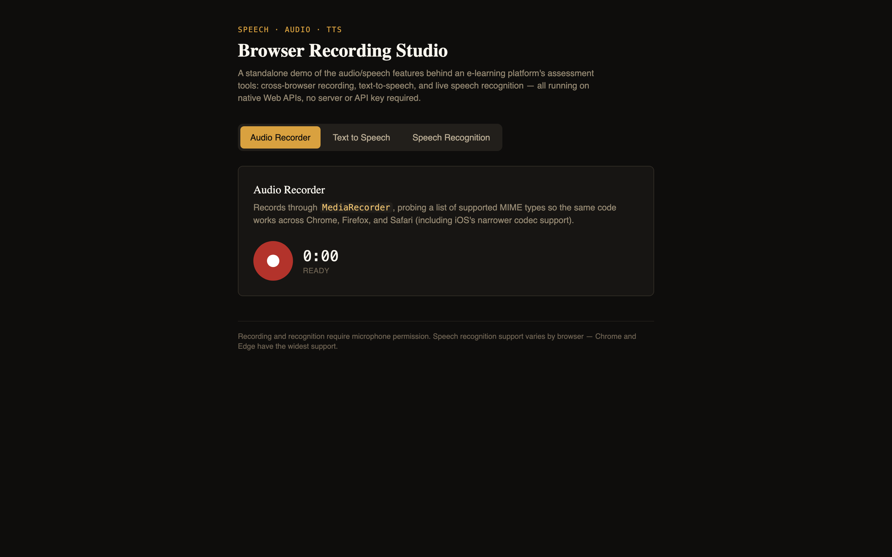

# Speech / Audio / TTS Studio

A standalone, no-backend demo of the three speech-and-media features that showed up repeatedly
across a production e-learning platform: cross-browser **audio recording**, **text-to-speech**,
and **live speech recognition**. Runs entirely on native Web APIs — no server, no API keys, no
paid services — so it's a zero-friction way to see (and read the code behind) the same feature
set described on a resume.



**[Live demo →](#)** *(deploy `npm run build` output to Vercel/Netlify/GitHub Pages and drop the link here)*

## Why this exists

A resume bullet like "cross-browser audio recording, including a dedicated iOS Safari fix" or "a
session-locking bug in the speech-recognition engine" is easy to write and impossible for a
recruiter to verify — that code lives inside a client's private repository. This project pulls the
same *category* of problem into a small, standalone app so the actual fixes are visible, readable,
and runnable by anyone who clones the repo.

## What's inside

### 1. Audio Recorder
Records through `MediaRecorder`. Browsers disagree on which audio container/codec they'll accept
— Safari (especially iOS) supports a much narrower set than Chrome — so `useAudioRecorder.ts`
probes a preference-ordered list of MIME types with `MediaRecorder.isTypeSupported()` instead of
hardcoding one, and only falls through to the browser's own default as a last resort. Supports
pause/resume, a live timer, in-browser playback, and download.

### 2. Text to Speech
Uses `window.speechSynthesis`. The common gotcha: `getVoices()` frequently returns an empty list
on the very first call because voice lists load asynchronously in most browsers (notably Chrome).
`useTextToSpeech.ts` handles this by also subscribing to the `voiceschanged` event and re-reading
the list once it actually fires, so the voice picker doesn't just silently stay empty. Includes
rate and pitch controls.

### 3. Speech Recognition
Uses the (still-prefixed-on-WebKit) `SpeechRecognition` interface for live, continuous
transcription. Demonstrates a real fix for a real bug class: calling `.start()` while a recognition
session is already active — or mid-teardown from a just-finished session — throws an
`InvalidStateError`. This happens easily: a fast double-click on "Start", or the browser's own
tendency to end a session after a pause in speech even with `continuous: true`. `useSpeechRecognition.ts`
guards this with an explicit session lock (`sessionLockRef`) checked before every `start()` call,
plus a transparent auto-restart when the browser ends a session the user never asked to stop.

## Running it

```bash
npm install
npm run dev       # http://localhost:5174
```

Grant microphone permission when prompted (needed for both the recorder and speech recognition
panels). Speech recognition has the widest support in Chrome and Edge; Safari and Firefox support
varies.

```bash
npm run build      # production build to dist/
npm run typecheck  # tsc --noEmit
```

## Project structure

```
src/
  hooks/
    useAudioRecorder.ts        MediaRecorder + cross-browser MIME handling
    useSpeechRecognition.ts    SpeechRecognition + session-lock fix
    useTextToSpeech.ts         speechSynthesis + async voice-loading fix
  components/
    AudioRecorderPanel.tsx
    TextToSpeechPanel.tsx
    SpeechRecognitionPanel.tsx
    TabBar.tsx
  types/speech.d.ts             Ambient types for the Web Speech API
  utils/format.ts
  App.tsx
```

Each hook is deliberately UI-agnostic — the panels are thin, and all of the actual browser-API
handling (including every workaround described above) lives in the hooks, which is where a
reviewer would look first.

## Browser support notes

- **Audio recording:** works in all modern browsers; codec support varies (handled via the MIME
  probing described above).
- **Text-to-speech:** broadly supported; voice *quality and selection* varies by OS/browser.
- **Speech recognition:** Chrome/Edge (Chromium) have the most complete support. Firefox does not
  implement `SpeechRecognition` as of this writing. Safari has partial/inconsistent support.

## Tech stack

React 18, TypeScript (strict), Tailwind CSS, Vite. No backend, no third-party audio/speech SDKs —
everything here is native browser API usage, which is the point: it's meant to demonstrate
first-hand familiarity with these APIs' rough edges, not a wrapper around someone else's library.

## Author

**Dhanyashree H P** — Senior Software Engineer (React.js, React Native, Mobile)
[linkedin.com/in/dhanya-chinivar-773b37115](https://linkedin.com/in/dhanya-chinivar-773b37115)
